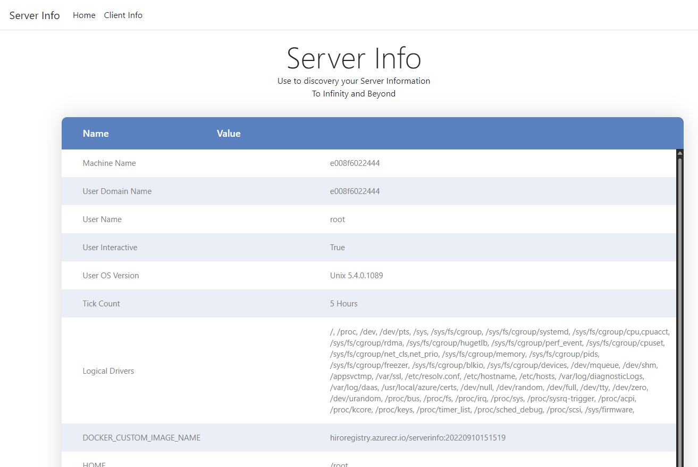
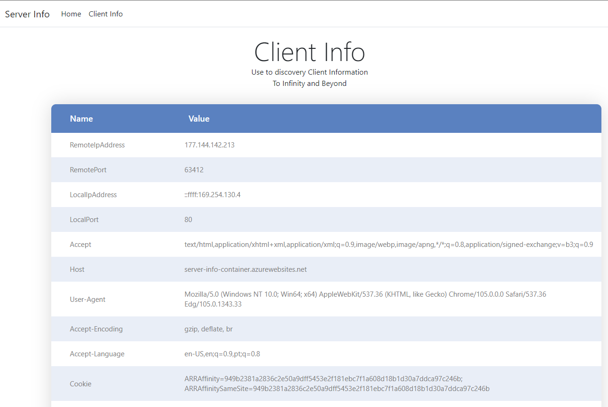

  

# Server Info
This app exposes Server and Client informations, resulted of a list of Environment.GetEnvironmentVariables method.

Usefull in development time to know environment virables and other informations.

Not recommended to leave on production environments, with public access.

## 1) Site Overview

 

- The home site exposes information about your infrastructure in a clean and easy table. 

 

 

- Client site exposes information about client (browser) that is accessing the site, as well some client informations that is available in code.

 

